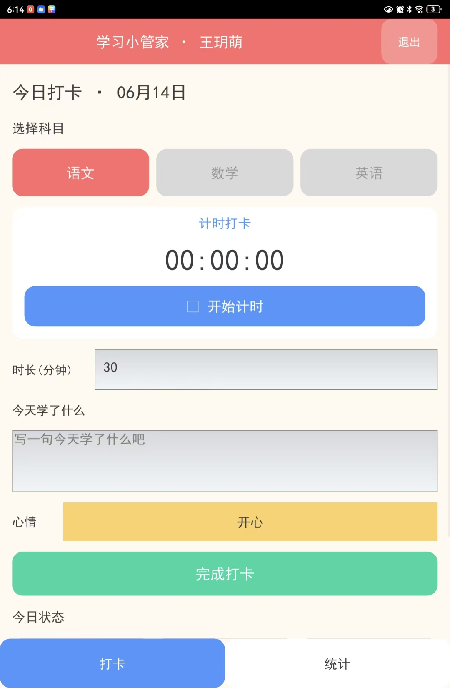
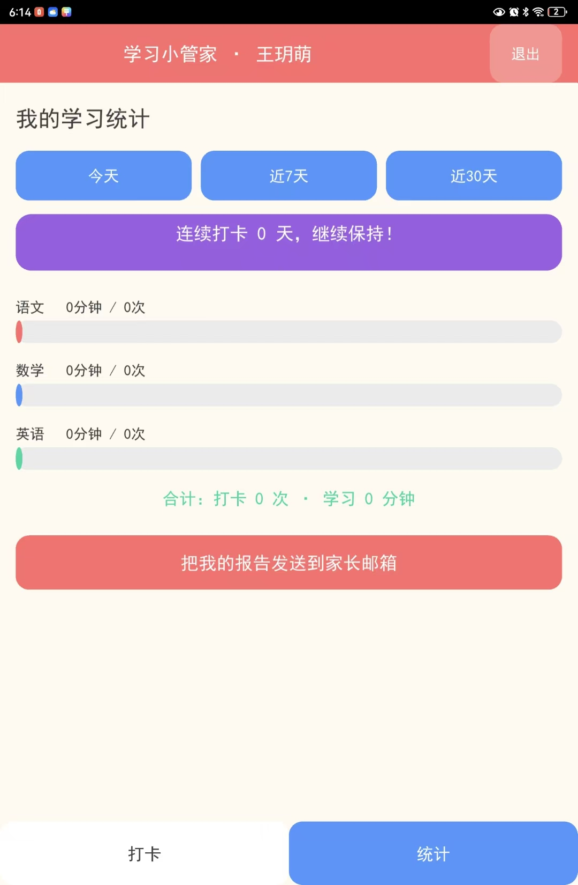

# 📱 学习小管家 · 安卓版

桌面版（Tkinter）的安卓移植版，用 **Kivy** 重写界面，复用全部后端逻辑
（数据库、统计、邮件、记住密码）。已把桌面版现有的 **配置和数据库一并导入**
（见 `core/seed/`），首次安装运行即带有原来的账号、打卡记录和邮箱设置。

## 📱 演示截图（真机运行）

| 每日打卡 / 计时 | 学习统计 |
|:---:|:---:|
|  |  |

## ✨ 功能（与桌面版一致）
- 登录 / 注册，**记住我**自动登录
- 语文 / 数学 / 英语 分科目打卡
- **计时打卡**：开始计时 → 结束计时自动按用时打卡
- 记录可**修改 / 删除**
- 学习统计（今天 / 近 7 天 / 近 30 天 条形图 + 连续打卡天数）
- 管理中心：邮箱设置、收件人增删、立即发送、测试邮件

默认管理员：`admin` / `admin123`。

---

## 🏗 如何生成可安装的 APK

> 本项目用纯 Python + Kivy，安卓打包需要 Linux 环境的 Buildozer。
> 因为 Windows 本机没有 Linux，**推荐用 GitHub Actions 云端构建**，零本地配置。

### 方式一（推荐）：GitHub 云端自动构建

1. 在 GitHub 新建一个仓库（名字随意，用英文）。
2. 把**本目录（`安卓版`）作为仓库根目录**推送上去：
   ```bash
   cd 安卓版
   git init
   git add .
   git commit -m "学习小管家安卓版"
   git branch -M main
   git remote add origin https://github.com/你的用户名/你的仓库.git
   git push -u origin main
   ```
3. 推送后，GitHub 的 **Actions** 标签页会自动开始「构建安卓 APK」（约 15–25 分钟）。
4. 构建完成后，进入该次运行页面，在底部 **Artifacts** 下载 `studyapp-debug-apk`，
   解压得到 `studyapp-*-debug.apk`。
5. 把 APK 传到安卓手机，点击安装（需在系统设置里允许「安装未知来源应用」）。

> 也可以不推送代码、直接在 Actions 页面点 **Run workflow** 手动触发（workflow_dispatch）。

### 方式二：本地 Linux / WSL / Docker 构建

在 Linux 或 WSL（Ubuntu）里：
```bash
pip install buildozer Cython==0.29.36
sudo apt-get install -y openjdk-17-jdk zip unzip autoconf libtool pkg-config \
  zlib1g-dev libncurses5-dev libtinfo5 cmake libffi-dev libssl-dev
cd 安卓版
buildozer android debug      # 产物在 bin/*.apk
```
首次构建会自动下载 Android SDK/NDK（数 GB），耗时较长。

---

## 💻 在电脑上预览界面（可选）

用 **Python 3.10 ~ 3.12**（Kivy 暂无 3.14 的预编译包）：
```bash
pip install kivy==2.3.0
cd 安卓版
python main.py
```
桌面运行的数据写入 `安卓版/localdata/`，不影响打包。

---

## 📁 目录结构
```
安卓版/
├── main.py                     # Kivy 应用（界面 + 交互）
├── buildozer.spec              # 安卓打包配置
├── requirements.txt            # 桌面预览依赖
├── .github/workflows/
│   └── build-apk.yml           # GitHub 云端构建 APK
├── assets/fonts/chinese.ttf    # 中文字体（Kivy 需内置才能显示中文）
└── core/                       # 后端逻辑（复用桌面版）
    ├── storage.py              # 跨平台数据路径 + 首次导入种子数据
    ├── config.py / database.py / stats.py / email_service.py / remember.py
    └── seed/
        ├── config.json         # ← 从桌面版导入的配置
        └── study.db            # ← 从桌面版导入的数据库
```

## ⚠️ 说明
- **数据导入**：APK 首次运行时，`core/seed/` 里的 `config.json` 和 `study.db`
  会复制到手机应用私有目录。之后在手机上的修改不再回写种子文件。
  若想用最新桌面数据重新打包，重新把桌面版的 `config.json`、`data/study.db`
  覆盖到 `core/seed/` 再构建即可。
- **中文字体**：内置的 `chinese.ttf` 来自 Windows 黑体（SimHei），仅供个人测试；
  如需公开分发，建议替换为开源字体（如思源黑体 Noto Sans SC）以避免字体版权问题。
- **邮件**：安卓已申请 INTERNET 权限；QQ 邮箱需填 16 位**授权码**（非登录密码）。
- **彩色 emoji**：手机端中文字体不含彩色 emoji，界面已改用文字+配色，不依赖 emoji。

## ☕ 打赏支持

如果这个小项目帮到了你或你的孩子，欢迎扫码请作者喝杯奶茶 🧋，感谢支持！


> 微信扫一扫，即可打赏
